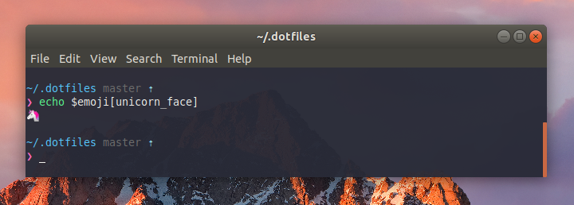

# Ahmed's dotfiles

<center>

</center>

**Warning:** If you want to give these dotfiles a try, you should first fork this repository, review the code, and remove things you don’t want or need. Don’t blindly use my settings unless you know what that entails. Use at your own risk!

## Installation

**1. Clone this repository:**

```sh
$ git clone https://github.com/ahmed-taj/dotfiles.git
```

**2. Run the installation script**

> **Caution:** The script will override existing files (e.g. .bashrc, .bash_profile ..etc)

This will create symlinks from this repo to your home folder.

```sh
$ ./install.sh
```

**3. Enable GNOME snazzy theme (optional)**

If you're a GNOME user and would like to try out the snazzy theme simply run:

```sh
$ ./snazzy/gnome.sh
```

## Features

* 🖥 Both `bash` and `zsh` are supported
* 🔥 [oh-my-zsh](http://ohmyz.sh/) + [zsh-syntax-highlighting](https://github.com/zsh-users/zsh-syntax-highlighting) out of the box
* 🦄 [Pure](https://github.com/sindresorhus/pure) prompt 
* 💅 Gnome Snazzy theme (inspired by [hyper-snazzy](https://github.com/sindresorhus/hyper-snazzy))


## Customization

If `.extra` exists, it will be sourced along with the other files. You can use this to add a few custom commands without the need to fork this entire repository, or to add commands you don’t want to commit to a public repository.

**Example:**

```sh
#!/bin/sh

# Git credentials
GIT_AUTHOR_NAME="user"
GIT_COMMITTER_NAME="$GIT_AUTHOR_NAME"
git config --global user.name "$GIT_AUTHOR_NAME"
GIT_AUTHOR_EMAIL="user@email.com"
GIT_COMMITTER_EMAIL="$GIT_AUTHOR_EMAIL"
git config --global user.email "$GIT_AUTHOR_EMAIL"
``` 

## License

This project is licensed under the terms of the MIT license. See [LICENSE](./LICENSE).